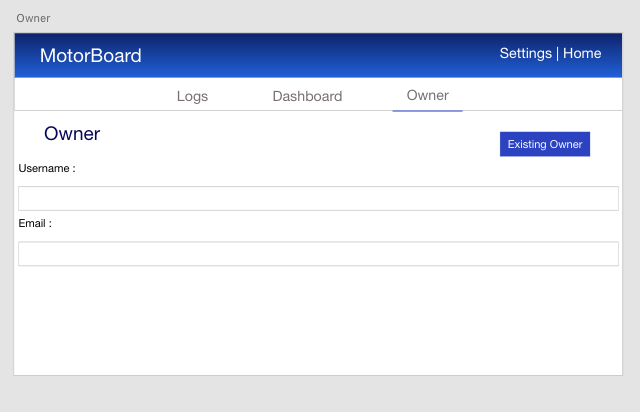

# Project Four: MotorBoard

## Overview
MotorBoard is an online log application that is used to help all motor vehicle owners keep track of their vehicle's service history. With this application, many motor vehicle owners will have a great source to keep their vehicle on the road longer than before. Usually when someone vehicles is serviced, you would either recieve a paper copy of what was service or a sticker telling you when to come back. With MotorBoad, not only will you have a copy from the shop, but you will be able to log that information into your own personal maintenance book online. To make the experience even better, you can add an image of your vehicle and even add multiple vehicles to your account to make sure you ensure the best life of your vehicles.

## Technologies Used
* Django
* React
* SQLite
* Python
* Javascript

## Links
[Heroku](https://evening-anchorage-06845.herokuapp.com/ "Heroku")

[Project Board](https://github.com/justinparrish/project-four/projects/2 "Project Board")

## Wireframes

## Entity Relationship Diagram (ERD)

